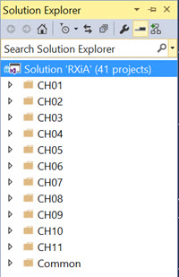

# Rx.NET In Action

[](https://gitter.im/tamirdresher/RxInAction?utm_source=badge&utm_medium=badge&utm_campaign=pr-badge&utm_content=badge)
[](https://ci.appveyor.com/project/tamirdresher/rxinaction)

This respository includes the source code for the [Rx.NET in Action](http://manning.com/dresher/)  book.

* The 'master' branch include the VS2017 version
* If you need the VS2015 version which include the `project.json` style of .NET Core projects, clone the `VS2015` branch

## How to use?

The solution is structured such that the examples from each chapter are located inside a folder with the chapter name 



Most of the projects are Console Applications, but some are standalone application in WPF. 
Inside each Console Application project, you'll find the `Main` method which contains the call for each example.
You can run all the examples, or comment out the ones you dont want to run.

for example, this is how the Main method of the Creational Operators examples from chapter 4 looks like

```c#
static void Main(string[] args)
{
    GenerateSequence();
    CreatingRangeObservable();
    ReadingAFileWithGenerate();
    CreatingSingleItemObservable();
    CreatingNeverendingObservable();
    CreatingObservableTheThrows();
    CreatingEmptyObservable();
    Console.ReadLine();
}  
```

